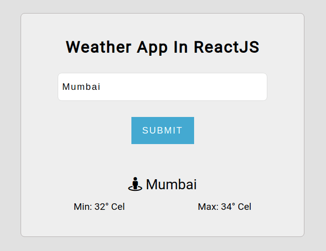

### Weather App

Displays the Minimum and Maximum temperature of the given city. If no city records found, it will display No results found message.

Behind the scenes, it uses the OpenWeather API to fetch all the temperature details.

API key is used in the .env.local file which is ignored from the repository, saved as
```
REACT_APP_OW_API_KEY=<your-key-here>
```

#### Screenshot

